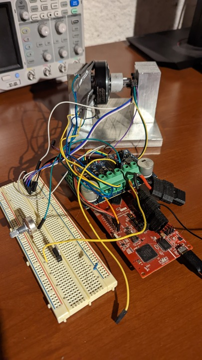

# Motor_Control

### The main file of intrest is [motor_control_main.c](motor_control_main.c)

This project is a BLDC motor controller using Texas Instruments LAUNCXL-F280049C evaluation board.

The program begins by creating a lookup table to cut down on clock cycles to generate a sinusoidal waveform.  It uses SPI to initialize the magnetic position sensor and then uses the quadrature ABI interface to keep track of rotor position.  ADC peripheral is used as a throttle to control PWM duty cycle.

## IDE

 - Code Composer Studio

## Hardware

 - LAUNCXL-F280049C
 - AS5047P-TS_EK_AB
 - DRV8300DRGE-EVM
 
 ## Setup
 
 
